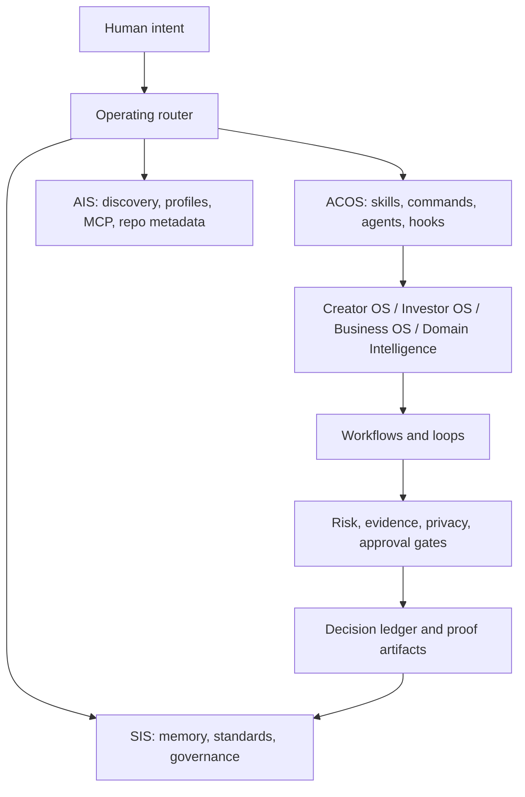

# Agentic Operating System Standard

**A public standard for building agent-native operating systems: Creator OS, Investor OS, Business OS, Domain Intelligence, and future intelligent systems that share one architecture.**

[](https://github.com/frankxai/agentic-operating-system-standard/actions/workflows/validate.yml)
[](./STANDARD.md)
[](./registry/agentic-operating-system-standard.json)

Most agent projects are collections of prompts, scripts, and scattered context files. An **Agentic Operating System** is different. It is a governed system of agents, skills, workflows, loops, ledgers, and approval gates that turns intent into repeatable execution.

This repository defines the shared language and architecture for that category.

## The Thesis

The next durable software category is not one more chat interface. It is a family of domain operating systems where humans, agents, tools, repos, workflows, and memory cooperate through explicit contracts.

The standard has one job: make those systems portable, inspectable, and good enough to become products.

## System Family

| Layer | Role | Example Repos |
|---|---|---|
| SIS | Intelligence kernel: memory, governance, taxonomy, evaluation, provenance. | `Starlight-Intelligence-System` |
| AIS | Discovery and capability routing: agents, skills, repo metadata, `llms.txt`, MCP. | `Agent-Intelligence-System` |
| ACOS | Creator execution substrate: skills, commands, agents, hooks, adapters. | `agentic-creator-os` |
| Domain Intelligence | First asset-intelligence vertical: names, portfolios, verification, offers. | `domain-intelligence-system` |
| Business OS | Founder, revenue, offer, ops, customer, partner, and execution system. | `agentic-business-os` |
| Investor OS | Deal flow, thesis, memo, diligence, portfolio support, and risk governance. | proposed module |
| Asset Intelligence | Cross-vertical asset layer for domains, content, offers, workflows, agents, and ops. | proposed umbrella |



## What This Standard Defines

| Artifact | Purpose |
|---|---|
| [STANDARD.md](./STANDARD.md) | Normative specification for compliant agentic operating systems. |
| [MODULES.md](./MODULES.md) | Module map for Creator OS, Investor OS, Business OS, Domain Intelligence, and shared substrates. |
| [AGENTS.md](./AGENTS.md) | Agent rules for this repo and a reusable doctrine for agent contracts. |
| [SKILLS.md](./SKILLS.md) | Skill format, quality bar, lifecycle, and publication rules. |
| [WORKFLOWS.md](./WORKFLOWS.md) | Canonical workflows used across modules. |
| [LOOPS.md](./LOOPS.md) | Persistent operating loops that make systems improve over time. |
| [Swarm Operating Model](./docs/SWARM_OPERATING_MODEL.md) | How to route multi-agent execution across strategy, product, risk, repo, and language lanes. |
| [registry](./registry/agentic-operating-system-standard.json) | Machine-readable standard registry. |
| [schemas](./schemas) | JSON schemas for modules, agents, and workflows. |
| [templates](./templates) | Copyable repo, module, agent, skill, and workflow templates. |

## Compliance Levels

| Level | Name | Requirement |
|---|---|---|
| L0 | Context Pack | Has a clear README and one reusable context file. |
| L1 | Skill Pack | Adds documented skills and activation rules. |
| L2 | Workflow System | Adds workflows, loop definitions, and validation. |
| L3 | Agent OS | Adds agent contracts, safety gates, ledgers, and repo governance. |
| L4 | Standard Module | Adds schemas, public/private boundaries, release discipline, and evidence artifacts. |
| L5 | Ecosystem Node | Interoperates across SIS, ACOS, AIS, GitHub, and multiple agent runners. |

## First Modules

- [Agentic Creator OS](./modules/creator-os.md): creator production, content, media, product, and launch execution.
- [Agentic Business OS](./modules/business-os.md): founder command, revenue architecture, customer success, partner systems, and operating cadence.
- [Agentic Investor OS](./modules/investor-os.md): thesis, deal flow, diligence, memo, portfolio support, and investor communications. Regulated decisions require qualified human review.
- [Domain Intelligence System](./modules/domain-intelligence.md): Web2 and Web3 domain candidate discovery, verification, routing, and monetization workflows.
- [Agentic Asset Intelligence](./modules/asset-intelligence.md): the cross-module standard for turning digital surfaces into verified, monetizable assets.

## Repository Strategy

This repo is the standard. Product modules can live in their own repos.

| Repo Type | Purpose | Visibility |
|---|---|---|
| Standard repo | Shared language, schemas, templates, and compliance rules. | Public |
| Open module repo | Public starter implementation, examples, documentation, and community adoption. | Public |
| Pro module repo | Private plugins, customer workflows, premium agents, private evals, managed delivery. | Private |
| Customer repo | Client-specific implementation and evidence ledger. | Private |

See [Repo Strategy](./docs/REPO_STRATEGY.md).

## Use It

Validate the standard:

```bash
npm run validate
```

Create a new module charter:

```bash
cp templates/module-charter.md modules/my-module.md
```

Create a repo profile:

```bash
cp templates/repo-readme.md README.md
cp templates/agents.md AGENTS.md
cp templates/skills.md SKILLS.md
```

## Commercial Strategy

The standard stays public. The revenue comes from modules, implementation, managed systems, audits, templates, training, and private plugin packs.

The first marketable offers should be concrete:

- Domain Portfolio Sprint.
- Creator OS setup and launch kit.
- Business OS founder command system.
- Investor OS diligence and portfolio support system.
- Agentic Operating System audit for teams.

See [Commercial Strategy](./docs/COMMERCIAL_STRATEGY.md).

## Non-Negotiables

- No hidden autonomous money movement.
- No investment, legal, medical, or tax claims without professional review.
- No public use of private customer data without approval.
- No agent action that bypasses human approval gates.
- No standard without validation, examples, and clear boundaries.

## Status

Public draft. Designed to become the shared specification behind FrankX, Starlight, Arcanea, ACOS, SIS, and specialized agentic operating system modules.
