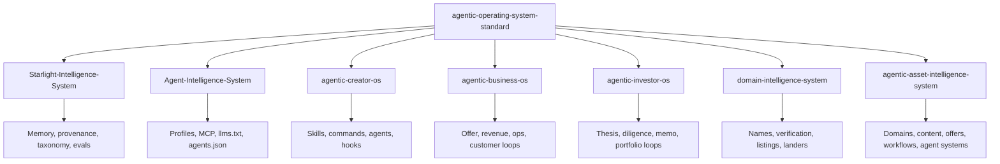

# Repo Graph

```mermaid
flowchart TD
  AOSS["agentic-operating-system-standard"] --> SIS["Starlight-Intelligence-System"]
  AOSS --> AIS["Agent-Intelligence-System"]
  AOSS --> ACOS["agentic-creator-os"]
  AOSS --> BOS["agentic-business-os"]
  AOSS --> IOS["agentic-investor-os"]
  AOSS --> DIS["domain-intelligence-system"]
  AOSS --> AAIS["agentic-asset-intelligence-system"]

  SIS --> Memory["Memory, provenance, taxonomy, evals"]
  AIS --> Discovery["Profiles, MCP, llms.txt, agents.json"]
  ACOS --> Execution["Skills, commands, agents, hooks"]
  BOS --> Business["Offer, revenue, ops, customer loops"]
  IOS --> Investor["Thesis, diligence, memo, portfolio loops"]
  DIS --> Domains["Names, verification, listings, landers"]
  AAIS --> Assets["Domains, content, offers, workflows, agent systems"]
```

## Ownership Model

The standard repo owns shared definitions. Module repos own implementations. Private repos own premium logic and customer delivery.
